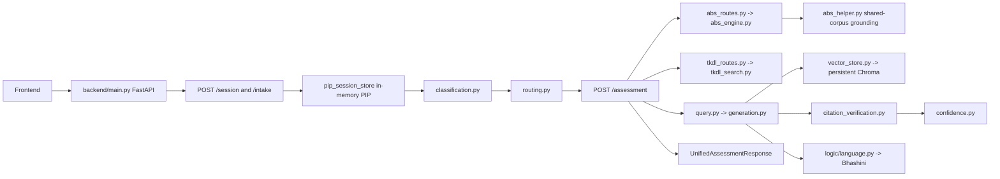

# Backend architecture and checklist trace

## Request path

## Module map

| Concern | Implementation | Main boundary |
|---|---|---|
| App and route registration | `backend/main.py` | CORS must list each deployed frontend origin. |
| PIP/session | `backend/models/pip.py`, `backend/routes/session.py`, `backend/routes/intake.py`, `backend/services/pip_session_store.py` | Active PIPs live in process memory; saved-account cases use SQLite. |
| Classification/routing | `backend/logic/classification.py`, `backend/routes/classify.py`, `backend/logic/routing.py` | Deterministic rules; classification has a known missing clinical-safety input noted in the PIP adapter. |
| ABS | `backend/routes/abs_routes.py`, `backend/logic/abs_helper.py`, `backend/logic/abs_engine.py`, `backend/models/abs_models.py` | Deterministic engine; missing or contradictory origin is now treated as abstention/escalation. |
| TKDL | `backend/routes/tkdl_routes.py`, `backend/logic/tkdl_search.py`, `backend/data/tkdl_real_records.py` | Offline source-derived archive; independent from ABS. |
| Legal RAG | `backend/routes/query.py`, `backend/rag/generation.py`, `backend/services/vector_store.py`, `chroma_data/` | Local Chroma data must be initialized/persisted separately in deployment. |
| Citation verification | `backend/logic/citation_verification.py`, `backend/services/citation_cache.py`, `backend/routes/citation.py` | Per-claim checks currently use lexical overlap; they do not establish legal correctness or robustly identify contradictory authorities. |
| Confidence/abstention | `backend/rag/confidence.py`, `backend/routes/query.py` | Confidence score is a pipeline-support heuristic, not a probability of legal correctness. |
| Bhashini | `backend/logic/bhashini_client.py`, `backend/logic/language.py`, `backend/logic/speech.py`, `backend/routes/bhashini_routes.py`, `backend/routes/voice.py` | Live behavior depends on backend secrets, enabled pipelines, and provider availability. |
| Unified assessment | `backend/routes/assessment.py` | `/assessment` combines classification/routing with optional legal answer and applicable ABS/TKDL results. |

## Traced request: legal question

1. The UI sends a session ID and question to `POST /query`.
2. `query_endpoint` resolves the saved PIP and translates the question to English when needed.
3. `answer_query` classifies/routes the PIP, retrieves chunks from the persistent Chroma collection, and calls Gemini only when relevant chunks exist.
4. Citation markers are matched to the exact chunks supplied to Gemini. Unsupported or uncited sentences are removed; confidence/abstention is calculated before output translation.
5. The answer, source chunk metadata, confidence breakdown, translation state, and query-log attempt are returned.

## Remaining design limits

- Citation support is explainable lexical overlap; semantic entailment and conflict-of-authority resolution require curated evaluations and legal review before they can be treated as automated legal determinations.
- The unified response has module-specific evidence in `RagResponse` and `ABSAssessment`, but not yet one normalized evidence-record collection shared across every module.
- Session and citation caches are process-local. Multi-worker/restart behavior needs shared persistence for production.
- Tests use deterministic/local paths. They do not verify live Gemini/Bhashini credentials or deployed-host secrets/CORS/storage.
